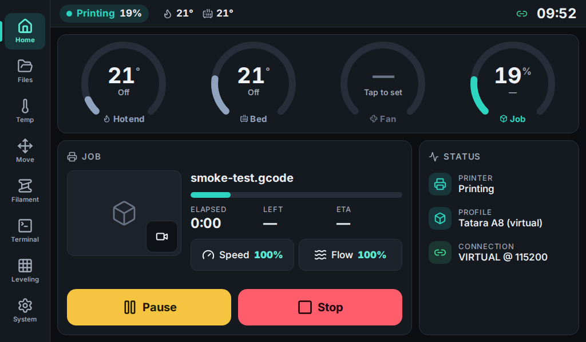
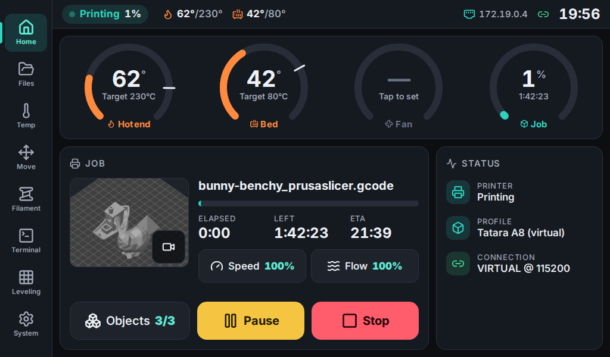
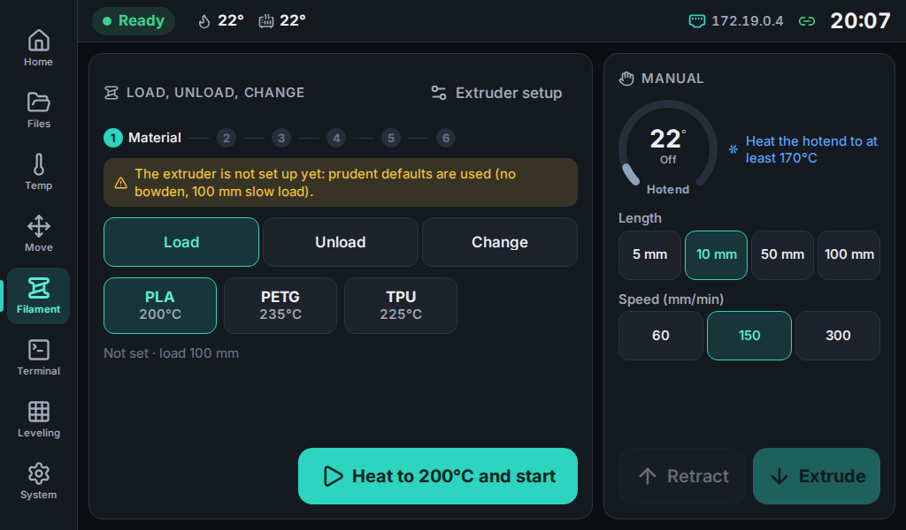
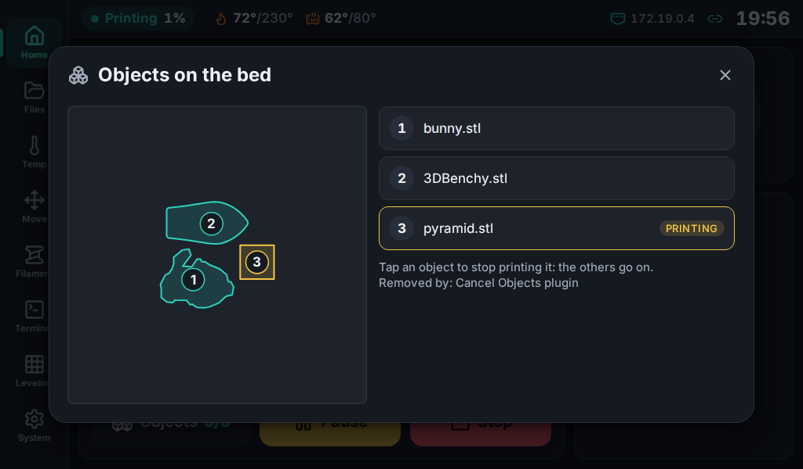
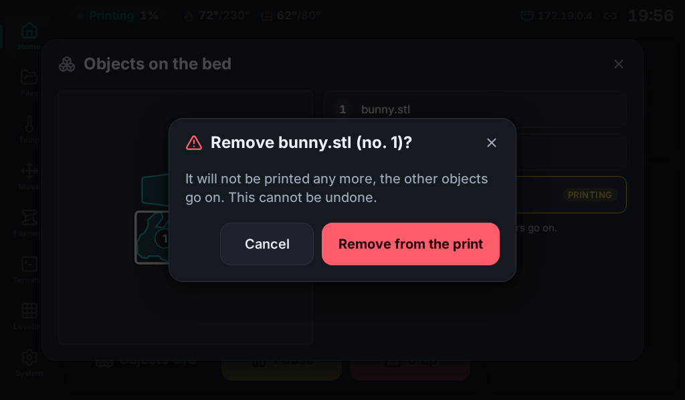
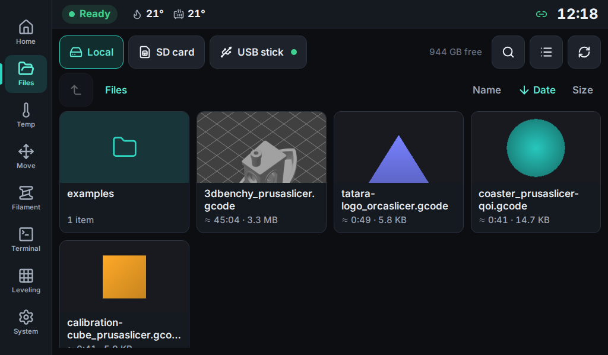
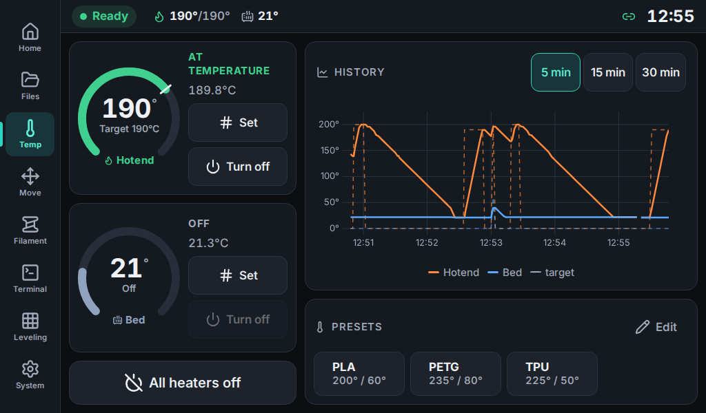
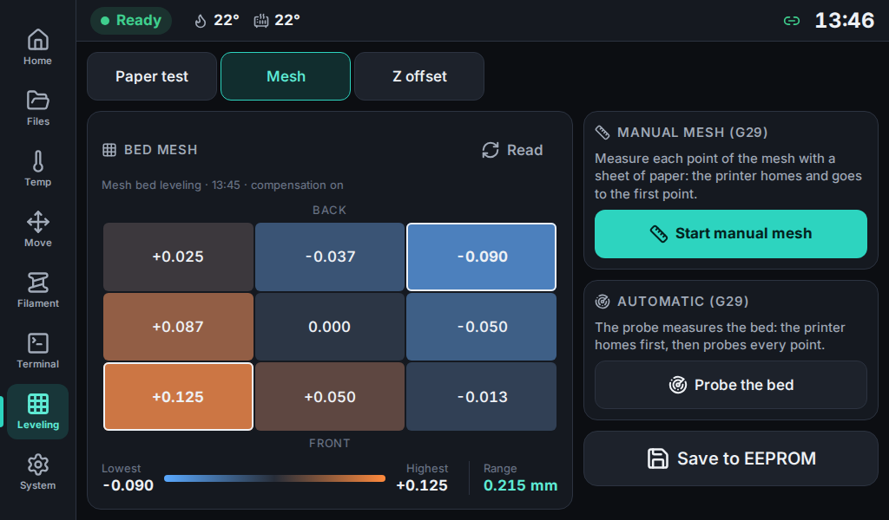
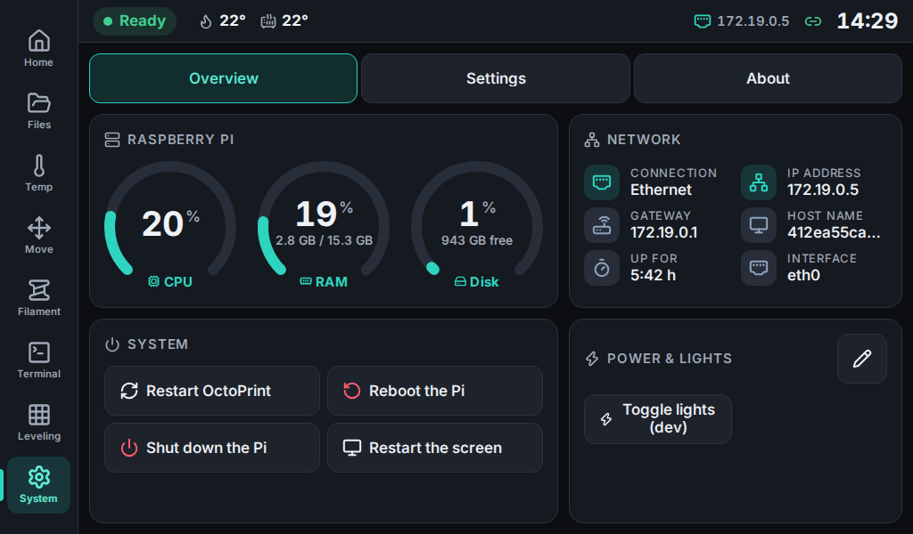

# FloppyOctoTouch

A touch-first dashboard for [OctoPrint](https://octoprint.org/), designed for a Raspberry Pi 4 running
OctoPi with a 7" 1024×600 HDMI touch screen, shown full screen in a Chromium kiosk.

> **Status: v0.12.0.** Every screen and the installer are done; the complete test on real hardware comes with
> v1.0.0. See [`CHANGELOG.md`](CHANGELOG.md) and [`docs/PLAN.md`](docs/PLAN.md) (Italian).



## Contents

- [Features](#features)
- [Slicer settings (PrusaSlicer)](#slicer-settings-prusaslicer)
- [Screenshots](#screenshots)
- [Installation on the Raspberry Pi](#installation-on-the-raspberry-pi)
  - [Quick start](#quick-start)
  - [Install without git](#install-without-git)
  - [Installer options](#installer-options)
  - [Update and uninstall](#update-and-uninstall)
  - [Troubleshooting](#troubleshooting)
  - [What the installer does](#what-the-installer-does)
- [How it works](#how-it-works)
- [Development](#development)
- [Project layout](#project-layout)
- [License](#license)

## Features

- **Home** — ring gauges for hotend, bed, fan, job and layer; progress, ETA, pause/resume/stop; live speed,
  flow and fan sliders; file thumbnail or webcam. When idle: recent files, preheat presets, homing.
- **Files** — OctoPrint storage with folders, search and sorting, the printer's SD card and USB sticks plugged
  into the Pi (import + safe eject). Slicer thumbnails (PrusaSlicer / OrcaSlicer) without plugins.
- **Temperature** — targets on a numpad, live chart, editable preheat presets.
- **Move** — X/Y/Z jog kept inside the build volume, homing, motors off.
- **Filament** — load / unload / change wizard, `M600` during a print, manual extrude and retract.
- **Terminal** — live serial log with filters, G-code keyboard, history and custom macro buttons.
- **Leveling** — paper test, bed mesh heatmap, manual or automatic mesh, babystepping, probe Z offset.
- **Cancel objects** — remove a single object during a print, from a bed map (Cancel Objects plugin or `M486`).
- **System** — CPU, RAM, disk and network; restart / reboot / shutdown; PSU Control and custom action buttons.
- **Settings** — language, accent colour, screensaver and screen off, date / time / time zone, API key,
  check and fix of what happens after Stop, and more.
- **Notices** — big end-of-print, failure and pause messages with a beep; Marlin host prompts as dialogs.
- **Offline and bilingual** — English and Italian, no internet needed; scales to screens other than 1024×600.
- **One-command installer** — kiosk, services and USB automount set up on OctoPi.

Details for each feature are in [`CHANGELOG.md`](CHANGELOG.md).

## Slicer settings (PrusaSlicer)

Two PrusaSlicer settings make the most of the dashboard (switch on **Expert** mode to see them):

- **Preview thumbnail** — in **Printer Settings → General → Firmware**, type `480x360/PNG` in the
  **G-code thumbnails** field. The thumbnail then shows on the Home and in Files.
- **Cancel objects** — in **Print Settings → Output options → Output file**, set **Label objects** to
  **OctoPrint comments** (works with the Cancel Objects plugin, which the installer offers). Choose
  **Firmware-specific** only if your Marlin has `M486` (`CANCEL_OBJECTS`) and it is switched on in System →
  Settings → Firmware. Files uploaded before the plugin was installed must be uploaded again.

## Screenshots

<table>
  <tr>
    <td width="50%" align="center"><br><sub>Home while printing, with the Objects button</sub></td>
    <td width="50%" align="center"><br><sub>Filament: load, unload or change, and manual extrusion</sub></td>
  </tr>
  <tr>
    <td width="50%" align="center"><br><sub>Cancel objects: bed map and list</sub></td>
    <td width="50%" align="center"><br><sub>Confirmation before removing an object</sub></td>
  </tr>
  <tr>
    <td width="50%" align="center"><br><sub>Files with slicer thumbnails</sub></td>
    <td width="50%" align="center"><br><sub>Temperature with the live chart</sub></td>
  </tr>
  <tr>
    <td width="50%" align="center"><br><sub>Leveling with the bed mesh heatmap</sub></td>
    <td width="50%" align="center"><br><sub>System with the Raspberry Pi metrics</sub></td>
  </tr>
</table>

## Installation on the Raspberry Pi

### Quick start

1. **What you need:** a Raspberry Pi 4 with **OctoPi 1.1.0** and OctoPrint already set up, and the 7" 1024×600
   screen connected (HDMI cable for the picture, USB cable for the touch).

2. **Create an API key in OctoPrint.** On a PC or phone, open OctoPrint in the browser (`http://octopi.local/`
   or the Pi's IP address) and log in. Click the **wrench icon** (Settings) at the top, then **Application Keys**.
   In **App identifier** type `FloppyOctoTouch`, click **Generate** and copy the key it shows.

3. **Run these commands on the Pi.** Open a terminal on the PC and connect over SSH (use the user and host name
   you chose in Raspberry Pi Imager if you changed them), then copy the lines as they are:

   ```sh
   ssh pi@octopi.local
   git clone https://github.com/FloppyO1/floppy-octopi-touch.git
   cd floppy-octopi-touch
   ./deploy/install.sh
   ```

   OctoPi already has `git`; if the command is missing, install it first with `sudo apt install -y git`.

4. **Answer the installer.** It asks everything at the start:
   - **the API key**: paste it (in most SSH terminals: right click or Ctrl+Shift+V) and press Enter. Nothing
     shows while you paste, that is normal. If OctoPrint refuses it, the installer asks again. Pressing Enter
     without a key is fine too: the touch screen asks for it later;
   - **"Install the Cancel Objects plugin?"** (it lets the dashboard remove single objects from a print) and
     **"Reboot automatically at the end?"** (not needed): press Enter.

   Then it works on its own for a few minutes (it downloads Chromium), shows a summary and starts the dashboard
   on the screen. If you asked for the reboot, it reboots after a 10-second countdown instead (Ctrl+C cancels it).

### Install without git

Copy the `floppy-octopi-touch` folder to the Pi (for example with `scp -r` or WinSCP) and run
`bash floppy-octopi-touch/deploy/install.sh`. Or copy only the release tarball and its checksum file from `release/`:

```sh
sha256sum -c floppyoctotouch-X.Y.Z.tar.gz.sha256
tar xzf floppyoctotouch-X.Y.Z.tar.gz
bash floppyoctotouch-X.Y.Z/deploy/install.sh
```

`bash …/install.sh` works even when the copy lost the executable bit (files copied from Windows or a zip).

### Installer options

The installer runs itself through `sudo` when needed and can be run again at any time: it repairs or
reconfigures the installation and keeps a saved API key that OctoPrint still accepts, without asking for it.

| Option | Effect |
|---|---|
| `--api-key=KEY` | use this key instead of asking (checked against OctoPrint; the installation stops if it is refused) |
| `--non-interactive` | never ask: detected or default answers (no automatic reboot) |
| `--user=NAME` | dashboard user instead of the one of `octoprint.service` |
| `--octoprint-url=URL` | OctoPrint address (default `http://127.0.0.1:<port>`) |
| `--display-config` | add the screen maker's lines to `config.txt` and `video=HDMI-A-1:1024x600@60` to `cmdline.txt` (with backups). Only useful with the legacy firmware display stack: with KMS (OctoPi's default) they change nothing, the kiosk sets the 1024×600 mode itself |
| `--skip-display-config` | do not touch `config.txt` / `cmdline.txt` (the default now; still accepted) |
| `--listen-lan` | agent on every interface instead of `127.0.0.1`. **Anyone on the network then controls the printer** (the agent adds the API key to every request) |
| `--no-cancel-plugin` | do not offer the Cancel Objects OctoPrint plugin (`--non-interactive` installs it otherwise) |

### Update and uninstall

```sh
cd floppy-octopi-touch && git pull && ./deploy/install.sh   # from the clone
floppyoctotouch-update floppyoctotouch-X.Y.Z.tar.gz         # from a tarball (+ its .sha256)
floppyoctotouch-uninstall                                   # --purge also deletes the configuration
```

Updates keep the API key, the dashboard settings and the kiosk options, and do not touch the display settings;
`floppyoctotouch-update` refuses a damaged tarball and asks before reinstalling the same version or going back
(`--force` skips the questions). Uninstalling removes the dashboard services and files, gives tty1 back to the
login prompt and removes the display lines added by `--display-config` (with a backup); the installed packages stay. Updates never
touch OctoPrint's plugins; uninstalling offers to remove the Cancel Objects plugin only if the installer added it
(`--non-interactive` keeps it).

### Troubleshooting

Logs: `journalctl -u floppyoctotouch-agent -u floppyoctotouch-kiosk -b` (add `-f` to follow them);
USB mounts: `journalctl -t floppyoctotouch-usb -b`. State: `systemctl status floppyoctotouch-kiosk`,
`curl http://127.0.0.1:8765/local/health`.

- **Black screen after boot.** The kiosk waits for the agent: check `systemctl status floppyoctotouch-agent`.
  If the agent runs, look at the kiosk log (cage needs the logind session on tty1: `loginctl` should list a
  session of the dashboard user on `seat0`/`tty1`). With a USB keyboard, **Ctrl+Alt+F2** opens another console.
- **Wrong resolution or no picture.** The kiosk sets the 1024×600 mode with `wlr-randr` at every start (the
  screen does not announce it, so with KMS `config.txt` and `cmdline.txt` cannot set it). Pick another mode in
  System → Settings → Screen (it goes back by itself after 15 s unless confirmed), or force one with
  `FOT_DISPLAY_MODE` in `/etc/floppyoctotouch/kiosk.env`. `ls /sys/class/drm` shows the connector name
  (`card?-HDMI-A-1` or `-HDMI-A-2` for the second port).
- **Chromium's "Something went wrong" page after hours on, or the installer warns about a 32-bit kernel.**
  OctoPi runs a 32-bit kernel (`arm_64bit=0` in `/boot/firmware/config.txt`, `uname -m` says `armv7l`): on a
  Pi 4 with more than 3 GB it keeps only ~768 MB for itself and can kill Chromium with gigabytes free (the
  dashboard restarts the kiosk by itself after a minute). The 64-bit kernel avoids it and the programs stay as
  they are: check that `/boot/firmware/kernel8.img` and a `/lib/modules/*-v8` folder exist, change the line to
  `arm_64bit=1`, `sudo reboot`; `uname -m` then says `aarch64` (set `arm_64bit=0` again to go back).
  `journalctl -k | grep -i oom` shows whether the OOM killer was the cause.
- **Touch does not respond.** The touch panel is a USB device: plug its cable in (the kiosk also starts without
  it) and restart the kiosk, `sudo systemctl restart floppyoctotouch-kiosk`. `ls /dev/input/by-id` should list
  it; the user must be in the `input` group (`id <user>`; rerun the installer to fix it).
- **"Connecting to OctoPrint…" / API key rejected.** Enter a new key from the overlay or System → Settings →
  Connection (the agent checks it and saves it), or run `./deploy/install.sh --api-key=KEY` again. Check that
  OctoPrint runs: `systemctl status octoprint`.
- **USB stick not shown.** It must be FAT32, exFAT, NTFS or ext4 and not on the boot disk; see the
  `floppyoctotouch-usb` log and `findmnt /media/usb-*`. exFAT needs a kernel that supports it (Bookworm does).
- **Wrong time or date.** `timedatectl` shows the zone, whether NTP is on and synchronised; changes made from
  the dashboard are logged with `journalctl -t floppyoctotouch-time -b`. Without internet switch the automatic
  time off in System → Settings → Date & time and set the clock by hand ("read only" there means the sudo rule
  is missing: run the update again).
- **Motors, heaters or fan stay on after Stop.** Check System → Settings → Motion → After Stop; the script is in
  OctoPrint → Settings → GCODE Scripts → "After print job is cancelled".
- **Screen off does not come back / wlr-randr errors.** The agent talks to the cage session through
  `WAYLAND_DISPLAY=wayland-0` in `/run/user/<uid>`; the screen-off option can be disabled in System → Settings.

### What the installer does

1. checks the system (Bookworm, arm64/armhf) and that OctoPrint answers on `127.0.0.1` (port taken from
   `octoprint.service`); the dashboard runs as the user of `octoprint.service` (normally `pi`);
2. asks its questions (API key, checked on `/api/version`; Cancel Objects plugin; reboot) and warns about a
   32-bit kernel on a Pi with more than 3 GB of RAM;
3. installs `cage`, `chromium` (or `chromium-browser`), `python3-venv`, `wlr-randr`, `fonts-dejavu-core`, `curl`;
4. copies the app to `/opt/floppyoctotouch` and creates the agent's virtual environment there;
5. writes `~/.config/floppyoctotouch/config.json` with mode 600;
6. installs the systemd units `floppyoctotouch-agent` and `floppyoctotouch-kiosk` (cage + Chromium on tty1,
   restarted if they stop) and disables the login prompt on tty1;
7. installs a udev rule that mounts USB sticks **read-only** on `/media/usb-<label>` (FAT32, exFAT, NTFS, ext4),
   a sudo rule limited to "eject a stick", "restart the kiosk" and the date/time wrapper
   (`deploy/time/time-set.sh`, which checks its arguments before calling `timedatectl`), and adds the user to
   `video`, `render`, `input`;
8. if accepted, installs the Cancel Objects plugin (a fixed, tested version) through OctoPrint's Plugin Manager API,
   like its own button, and restarts OctoPrint unless it is printing;
9. only with `--display-config`: adds the screen maker's lines to `config.txt` and `video=HDMI-A-1:1024x600@60` to
   `cmdline.txt` (in `/boot/firmware`, with backups);
10. starts the agent, prints a summary and reboots (or starts the kiosk).

| Path | What |
|---|---|
| `~/.config/floppyoctotouch/config.json` | agent configuration: API key, OctoPrint URL, webcam URL, USB and display options (mode 600) |
| `~/.config/floppyoctotouch/settings.json` | dashboard settings (changed from the System screen) |
| `/etc/floppyoctotouch/kiosk.env` | kiosk page and extra Chromium flags (`sudo systemctl restart floppyoctotouch-kiosk`) |
| `/etc/floppyoctotouch/install.conf` | what the installer did (user, `cmdline.txt` token, Cancel Objects plugin), read by update/uninstall |
| `/opt/floppyoctotouch` | app, agent venv, deploy scripts |

More detail in [docs/ARCHITECTURE.md](docs/ARCHITECTURE.md#deployment-on-the-pi).

## How it works

```
Chromium (kiosk) ──► agent 127.0.0.1:8765 ──► OctoPrint 127.0.0.1:5000
                      • serves the web app
                      • proxies /api, /sockjs, /plugin, /downloads and adds the API key
                      • proxies /webcam/* to camera-streamer (127.0.0.1:8080), like OctoPi's haproxy
                      • local endpoints: /local/health, /local/settings, /local/system (CPU, RAM, disk,
                        network), /local/apikey, /local/kiosk/restart, /local/display (HDMI on/off),
                        /local/thumbnail (G-code thumbnails), /local/usb (USB stick), /local/events, …
```

The browser never sees the OctoPrint API key: the Python agent injects it. For this reason the agent listens on
`127.0.0.1` only. Details in [`docs/ARCHITECTURE.md`](docs/ARCHITECTURE.md).

- **Frontend**: Svelte 5 + TypeScript + Vite (`frontend/`).
- **Agent**: Python 3.11 + aiohttp (`agent/`).

## Development

Everything runs in Docker: nothing (Node, Python, Playwright…) needs to be installed on the host.
Requirements: Docker with Compose v2 (Docker Desktop on Windows/macOS works).

```sh
# optional: copy and adjust ports / credentials
cp dev/.env.example dev/.env

docker compose -f dev/docker-compose.yml up -d
```

| URL | What |
|---|---|
| http://localhost:5173/preview.html | the dashboard inside a 1024×600 frame (Vite dev server, hot reload) |
| http://localhost:5173/ | the dashboard without frame |
| http://localhost:8765/ | the agent (serves `frontend/dist` once built, same as on the Pi) |
| http://localhost:5000/ | OctoPrint with the Virtual Printer (user `admin`, password `admin`) |

The development OctoPrint is prepared automatically on first start (`octoprint-init` service): seed config
(Virtual Printer with SD card, auto-connect, 220×220×240 printer profile), admin user, sample G-code files
(plus an `examples/` folder and one file on the virtual SD card).
To start from scratch: `docker compose -f dev/docker-compose.yml down -v`.

The `webcam` service is a fake camera: an MJPEG test pattern with a frame counter (ffmpeg `testsrc`) on port 8080,
like camera-streamer on OctoPi. OctoPrint's default stream URL `/webcam/?action=stream` reaches it through the
agent. Stop it (`docker compose -f dev/docker-compose.yml stop webcam`) to see the "no webcam" fallback. In Docker
the HDMI power endpoint (`/local/display`) only logs (`FOT_DISPLAY_BACKEND=none`).

`dev/fake-usb/` is the fake USB stick (`/media/usb0` in the agent, read-only): drop `.gcode` files there and tap
refresh on the USB tab. The agent notices a stick appearing or disappearing within 2 s. There is no udev/systemd
in Docker, so "Eject" only hides the stick until its content changes (`FOT_USB_EJECT_COMMAND=none`). The agent
reads OctoPrint's uploads (volume mounted read-only) to extract thumbnails, as it does on the Pi.

Agent settings added for files and the System screen (in `config.json` or as `FOT_*` environment variables):

| Setting | Default | What |
|---|---|---|
| `uploads_dir` (`FOT_UPLOADS_DIR`) | `~/.octoprint/uploads` | OctoPrint's local storage, read for thumbnails (download through OctoPrint if not readable) |
| `usb_roots` (`FOT_USB_ROOTS`) | `/media/usb*` | glob patterns of the USB stick mount points |
| `usb_eject_command` (`FOT_USB_EJECT_COMMAND`) | `systemd-mount --umount {path}` | command that unmounts a stick; `none` only hides it |
| `usb_max_file_mb` (`FOT_USB_MAX_FILE_MB`) | `1024` | largest file accepted for import |
| `kiosk_restart_command` (`FOT_KIOSK_RESTART_COMMAND`) | `sudo -n systemctl restart floppyoctotouch-kiosk.service` | "Restart the screen" on the System screen; `none` only logs (the page reloads) |
| `kiosk_watchdog_s` (`FOT_KIOSK_WATCHDOG_S`) | `60` | seconds without the kiosk page (e.g. Chromium's renderer crashed) before the kiosk is restarted with `kiosk_restart_command`; `0` turns it off |
| `disk_path` (`FOT_DISK_PATH`) | `/` | file system shown as "disk" on the System screen |

Pages and URL options useful while developing:

| URL | What |
|---|---|
| `/#/home`, `/#/files`, … `/#/system` | a screen of the app (the hash keeps the current screen across reloads) |
| `/ui-gallery` | every design-system component with demo data (dev server only) |
| `/debug` | every data store: connection, printer state, job, temperatures, files, capabilities, plugins, prompts, settings, events, terminal (dev server only) |
| `?accent=teal\|amber\|indigo` | previews an accent colour (the saved one is chosen on the System screen) |
| `?kiosk=1` | kiosk hardening: hidden cursor, no context menu, no zoom, no text selection or dragging |

In the Vite dev server the stores are also available in the browser console as `window.__fot`.

The Virtual Printer can emit Marlin host actions to test prompts and notifications, e.g. send
`!!DEBUG:action_custom notification Hello` from the OctoPrint terminal (the `/debug` page has buttons for this).
Prompts are shown only when the firmware reports `Cap:PROMPT_SUPPORT` (or the override is on).

### OctoPrint API key

The agent authenticates to OctoPrint with an API key taken from `OCTOPRINT_API_KEY` in `dev/.env`.
In development you do not need to create it: `octoprint-init` registers that value as an application key of the
dev user at every start (a default value is used when `dev/.env` does not exist).

To use a key created by hand (as you will do on the Pi):

1. open OctoPrint at http://localhost:5000 and log in;
2. go to **Settings → Application Keys**, enter an application name (e.g. `FloppyOctoTouch`) and click **Generate**;
3. put the key in `dev/.env` as `OCTOPRINT_API_KEY=...` and restart: `docker compose -f dev/docker-compose.yml up -d`.

`http://localhost:8765/local/health` tells whether OctoPrint is reachable and the key is accepted.

The key can also be replaced from the dashboard (System → Settings → Connection, or the button on the
"connecting" overlay when OctoPrint rejects it): the agent checks it against OctoPrint, saves it in its
`config.json` (mode 600) and uses it at once. A key set through `FOT_API_KEY` (as in Docker) wins again at the
next start.

The development OctoPrint has harmless reboot/shutdown commands (`echo`) and a custom `Toggle lights (dev)`
system command, so the System screen shows them; the smoke test intercepts reboot/shutdown anyway.

### Recurring commands

All commands are run from the repository root.

| Command | What |
|---|---|
| `docker compose -f dev/docker-compose.yml up -d` | start OctoPrint, agent and Vite |
| `docker compose -f dev/docker-compose.yml logs -f agent` | follow the agent logs (same for `octoprint`, `frontend`) |
| `docker compose -f dev/docker-compose.yml down` | stop everything (`-v` also wipes OctoPrint data) |
| `docker compose -f dev/docker-compose.yml run --rm agent-test` | agent: ruff lint + format check + pytest |
| `docker compose -f dev/docker-compose.yml run --rm frontend-test` | frontend: svelte-check + tsc + vitest |
| `docker compose -f dev/docker-compose.yml run --rm build` | production build of the frontend into `frontend/dist` |
| `docker compose -f dev/docker-compose.yml run --rm playwright` | smoke test (data layer, every screen, NumPad and confirmations, host prompt, printer overlay, Files (folders, sort, search, detail, delete, SD card, USB import/eject), Temperature (targets, presets CRUD), Move (jog limits), Temperature during a heat-up (M108), Filament (setup, load/unload/change wizard, cancel, cool down at the end, manual extrusion), Terminal (keyboard, filters, pause, history), macros CRUD, Leveling (paper test, mesh heatmap, manual mesh, babystep, probe offset), System (metrics, system commands, custom actions and status bar, every settings section, API key, reset, PSU Control), a real print from the Home with fan/speed sliders, pause/resume, webcam and the end-of-print notice, screensaver and screen off, kiosk mode, scaling on other screen sizes, language) + 1024×600 screenshots into `dev/screenshots/`; `-e ONLY=terminal,leveling` runs only those steps |
| `docker compose -f dev/docker-compose.yml run --rm playwright sh -c "npm install && node accents.mjs"` | screenshots of Home, NumPad and gallery for each accent colour |
| `docker compose -f dev/docker-compose.yml run --rm playwright sh -c "npm install && node targets.mjs"` | lists the touch targets under 56 px on every screen (`MIN_TARGET=` to change the size) |
| `docker compose -f dev/docker-compose.yml run --rm shellcheck` | lint every shell script |
| `docker compose -f dev/docker-compose.yml run --rm release` | build `release/floppyoctotouch-<version>.tar.gz` + `.sha256` (web app, agent wheel, `deploy/`); older tarballs are deleted |
| `docker compose -f dev/docker-compose.yml run --rm deploy-test` | installer test in Debian bookworm: install, checks, agent + kiosk launcher, USB helper, reinstall, update, uninstall, install from a clone, sudo self-elevation, interactive questions on a fake terminal |

Sample G-code files with PrusaSlicer (PNG, QOI) and OrcaSlicer thumbnails live in `dev/sample-gcode/` and are
generated by `dev/tools/make_sample_gcode.py`; `3dbenchy_prusaslicer.gcode` is a real PrusaSlicer 2.9 export for
the Tatara A8 profile (240 layers, about 45 min, 300×300 PNG thumbnail), handy for long jobs and real file info.
`dev/fake-usb/` is mounted into the agent as a fake USB stick.

`docs/github/release.yml` is a ready GitHub Action, not active yet: copied to `.github/workflows/`, it tests and
builds the release at every `v*` tag and attaches the tarball to a draft GitHub release.

## Project layout

```
agent/      Python agent (aiohttp): static files, OctoPrint proxy, local endpoints
frontend/   Svelte 5 + TypeScript web app
deploy/     install/update/uninstall scripts, systemd units, kiosk launcher, USB automount, udev/sudo/PAM files
dev/        Docker Compose environment, OctoPrint seed, Playwright scripts, sample G-code
docs/       plan (Italian) and architecture notes
scripts/    build-release.sh (release tarball)
release/    the latest release tarball + .sha256 (installed by deploy/install.sh from a clone)
```

## License

[MIT](LICENSE) © 2026 Filippo Castellan
